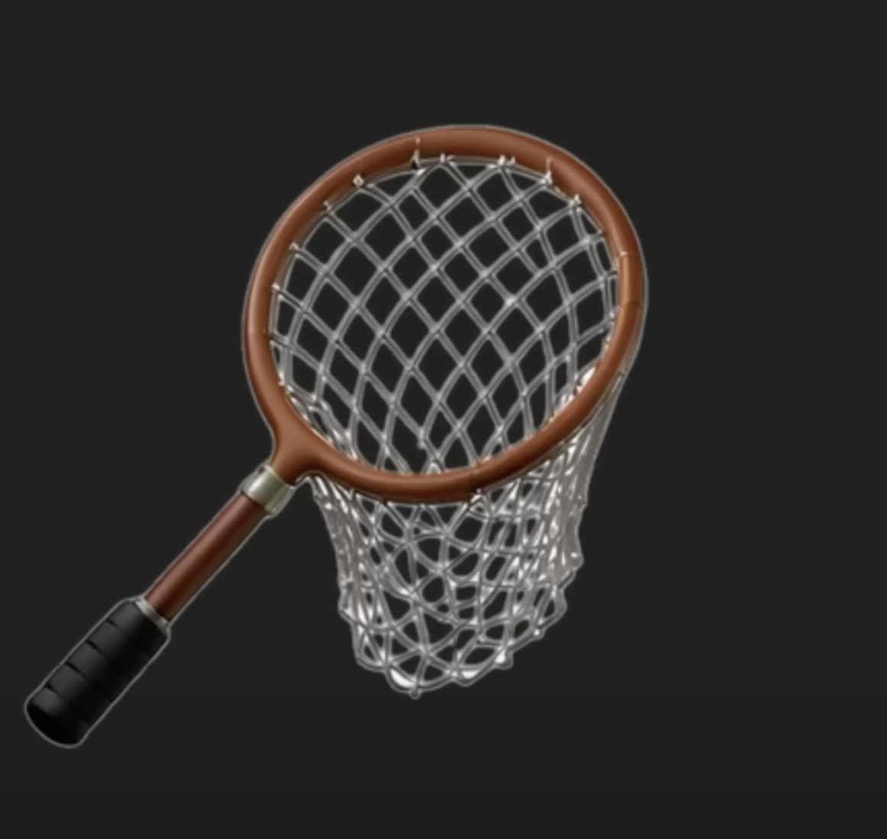

# Genmoji - Apple GenMoji Recreation

A project to recreate Apple's GenMoji functionality by fine-tuning image generation models to create emoji-style images from text descriptions.

## Overview

This project aims to fine-tune image generation models to create Apple-style emojis from text prompts like "flying pig". The models will be quantized to run efficiently on mobile devices.

## Project Roadmap

1. **Data Collection**
   - Scrape emoji PNGs and descriptions from [emojigraph.org](https://emojigraph.org)
   - Process images to add white backgrounds (similar to Apple's approach)
   

2. **Model Development**
   - Fine-tune separate image generation models for different skin tones and person types
   - Quantize models for mobile deployment
   - Implement LLM for prompt engineering and enhancement

3. **Applications**
   - Build Gradio web interface for testing
   - Develop iOS application (planned)

## Setup

[Coming soon]

## Usage

[Coming soon]

## License

[Coming soon]

## What is LoRA?

LoRA (Low-Rank Adaptation) is a technique to efficiently fine-tune large models with limited resources. Here's how it works:

### Core Concept
Instead of updating all model weights during fine-tuning (which requires a lot of memory), LoRA freezes the original model weights and adds small "adapter" matrices to key layers.

### Mathematical Approach 
For a weight matrix W in the original model, LoRA decomposes the update into two smaller matrices: W = W₀ + BA, where:
- W₀ is the original frozen weight
- B and A are much smaller matrices (controlled by a rank parameter 'r')
- Only B and A are trained, dramatically reducing memory requirements

### For Image Generation
LoRA modifies attention layers in the model, teaching it new concepts (in this case, emoji style) without changing its fundamental capabilities.

| Quantization Method          | Pros                                                                 | Cons                                                                 |
|------------------------------|----------------------------------------------------------------------|----------------------------------------------------------------------|
| **Before Fine-tuning**       | - Reduced Memory Usage: Lowers VRAM requirements during training     | - Potential Accuracy Impact: May reduce model's representational capacity |
|                              | - Faster Training: Speeds up training on memory-limited hardware     | - Base Model Limitations: Some operations might be less precise     |
|                              | - Larger Batch Sizes: Allows larger batch sizes on same hardware     | - Implementation Complexity: Requires setup before training         |
|                              | - LoRA Efficiency: Adapters remain in full precision                 | - Limited Quantization Methods: Not all methods work well with training |
|                              | - Practical for Consumer Hardware: Possible on devices like MacBook Air M3 |                                                                      |
|                              | - Simplified Workflow: No need to quantize after training            |                                                                      |
| **After Fine-tuning**        | - Full Precision Training: Preserves maximum model capacity          | - Higher Training Requirements: Needs more memory during training    |
|                              | - Potentially Higher Quality: Captures subtle patterns               | - May Be Impractical: Often impossible on consumer hardware         |
|                              | - Flexible Quantization Options: Choose methods after results        | - Two-Step Process: Requires additional step after training         |
|                              | - Targeted Optimization: Optimize for inference post-training        | - Risk of Overfitting: Full precision might overfit to training data |
|                              | - Multiple Export Options: Create different versions for deployment  | - Longer Training Time: Full precision training takes longer         |